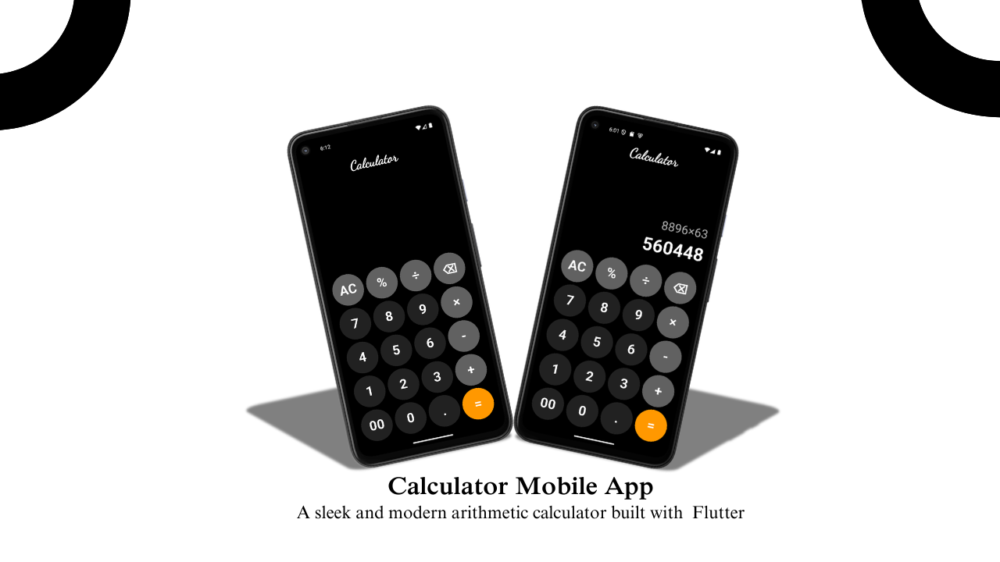

<h1 align="center">🧮 Flutter Calculator App</h1>

<p align="center">
  A simple Calculator App built using Flutter that performs basic arithmetic operations 
  like addition, subtraction, multiplication, and division.
</p>

<p align="center">
  
</p>

---

## ✨ Features

✔️ Addition  
✔️ Subtraction  
✔️ Multiplication  
✔️ Division  
✔️ Clear Button  
✔️ Responsive UI  

---

## 🚀 Getting Started

```bash
git clone https://github.com/your-username/calculator-app.git
cd calculator-app
flutter pub get
flutter run
```

---

## 🛠️ Built With

- Flutter  
- Dart  

---

## 👨‍💻 Author

**Deepak Kumawat**
